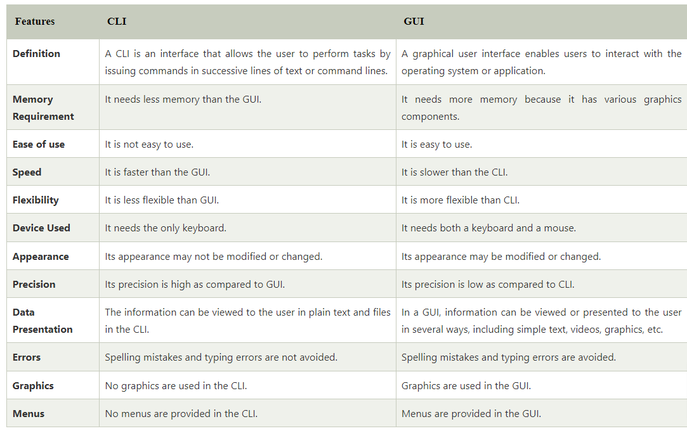
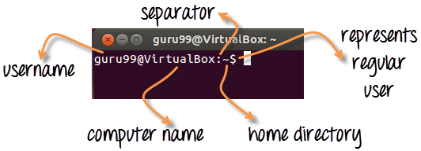

## Difference between CLI and GUI

## Why learn Command Line Interface?

---

Even though the world is moving to GUI based systems, CLI has its specific uses and is widely used in scripting and server administration. Let's look at it some compelling uses --

- Comparatively, Commands offer more options & are flexible. Piping and stdin/stdout are immensely powerful are not available in GUI
- Some configurations in GUI are up to 5 screens deep while in a CLI it's just a single command
- Moving, renaming 1000's of the file in GUI will be time-consuming (Using Control /Shift to select multiple files), while in CLI, using regular expressions so can do the same task with a single command.
- CLI load fast and do not consume RAM compared to GUI. In crunch scenarios this matters.

Both GUI and CLI have their specific uses. For example, in GUI, performance monitoring graphs give instant visual feedback on system health, while seeing hundreds of lines of logs in CLI is an eyesore.

## Launch CLI

- use dashboard to open a new terminal or,
- you can press CTRL + Alt + T to launch the Terminal

## Relative and Absolute Paths

---

A path in computing is the address of a file or folder.
Example --
In Windows
`C:\documentsandsettings\user\downloads`
In Linux
`/home/user/downloads`

- **Absolute Path:-**
  - 
- **Relative Path:-**
  - 
