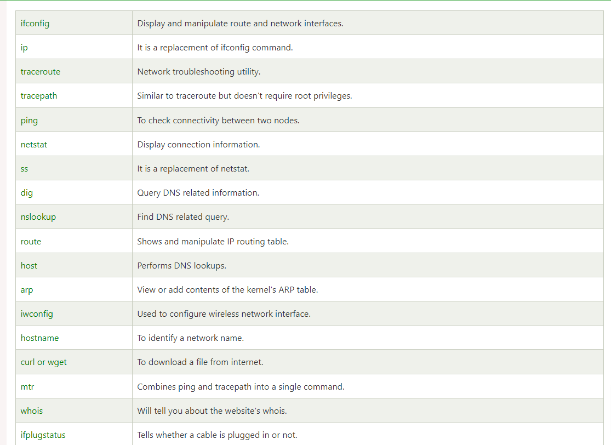

### Networking Commands

| COMMAND    | MEANING                                                                              |  SYNTAX              |
| ---------- | ------------------------------------------------------------------------------------ | -------------------- |
| `dir`      | This command is used to display files in the current directory of a remote computer. | Syntax: `$ dir`      |
| `put file` | This command is used to upload 'file' from local to the remote computer.             | Syntax: `$ put file` |
| `get file` | This file is used to download 'file' from remote to the local computer.              | Syntax: `$ get file` |
| `quit`     | This command is used to log out.                                                     | Syntax: `$ quit`     |

