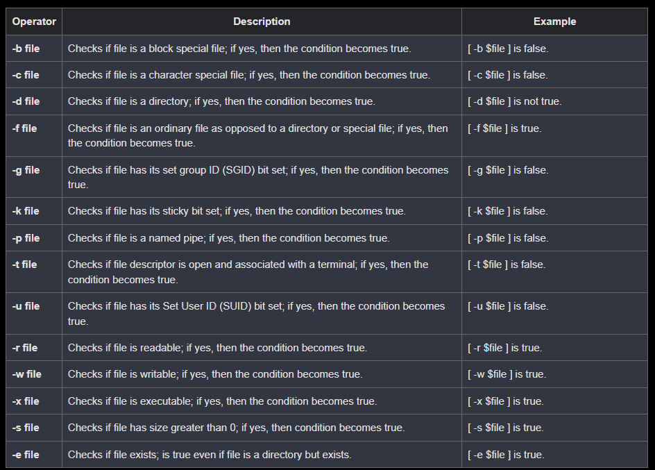

# Shell File Test Operators

- We have a few operators that can be used to test various properties associated with a Unix file.
  Assume a variable file holds an existing file name "test" the size of which is 100 bytes and has read, write and execute permission on −

